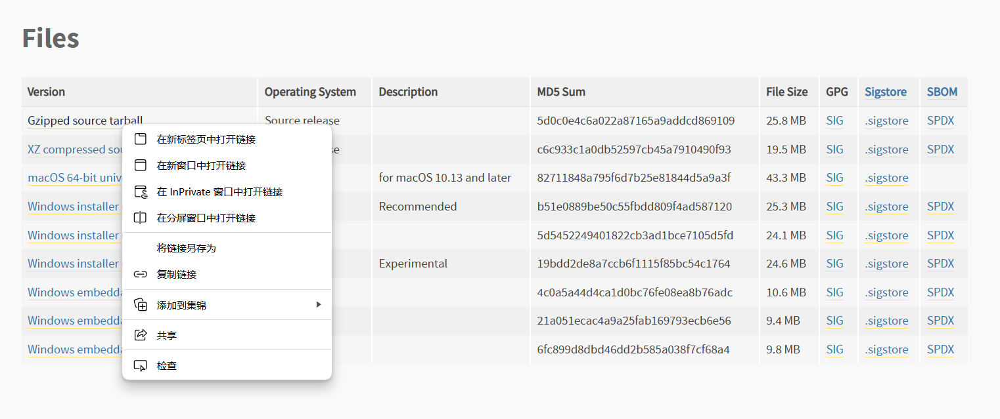

# **linux** 从源码安装

Linux系统下安装软件的方式可以通过  **apt install**  类似的包管理命令在线安装。

    apt install packagename

若软件源中没有对应软件，需要从源码编译安装。

## 准备工作

- ### 下载源码包

首先准备好要安装软件的源码

以python3.12为例，去官网找到对应源码包的链接

<https://www.python.org/downloads/>

用 **wget** 下载到本地

    wget "https://www.python.org/ftp/python/3.12.7/Python-3.12.7.tgz"

- ### 解压源码包

使用内置的tar解压

    tar -xvf Python-3.12.7.tgz
    cd Python-3.12.7/

- ### 安装编译工具

源码中有许多.c的文件，由c语言编写。因此编译前需要安装c语言库和环境。

    apt update
    apt install build-essential
    apt install make build-essential libssl-dev zlib1g-dev libbz2-dev libreadline-dev libsqlite3-dev wget curl llvm libncurses5-dev libncursesw5-dev xz-utils tk-dev libffi-dev liblzma-dev
    apt install gcc openssl

## 编译预配置

源码根目录下存在一个configure文件，运行该文件，开始检查当前的运行环境，配置生成 **MakeFile** 文件，用于make编译。

    ./configure --with-openssl=/usr/bin --prefix=/opt/python3.12.7

这里的 --prefix=/path 是指定你要安装软件的目录，可以mkdir创建。

通常，我们都将软件安装在 **/opt** 下。

configure的过程并不都是顺利的，要学会看报错信息，把没装的包用apt装上

## 编译

(
如果之前预编译过，先
    make clean
来清除缓存
)

首先告诉 make 配置文件MakeFile位于何处

    make MakeFile

执行make，开始编译

    make

等待编译结束

## 安装

    make install

执行安装命令

## 配置软连接

这时cd到opt的目录，可以看到python已经安装好了。

如果直接执行 python ，会报错 not found.

因为linux执行某条命令，主要先访问 **/bin** 或 **/usr/bin** 等**PATH**是否有对应的二进制文件

因此需要将python的二进制文件复制

创建软连接

    ln -s /opt/Python-3.12.7/bin/python3 /usr/bin

再执行python3，可以正常启动
